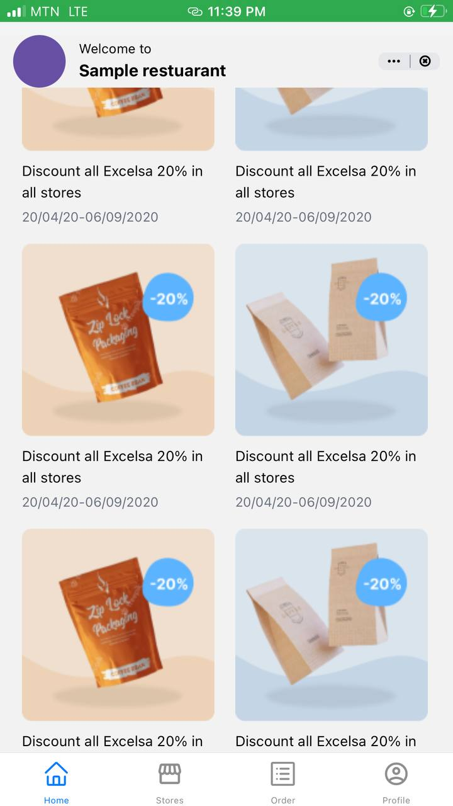
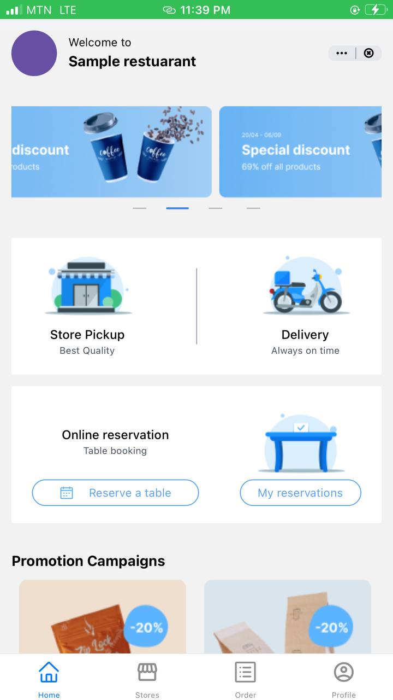

#Food and Beverage Delivery Mobile App
Food and Beverage Delivery Mobile is a mobile applications that allows users or customers to order or purchase foods and beverages from the places of convenience.
This mobile application consists of four different main screens. 
1. The Home screen
2. The Stores screen
3. The Order screen 
4. The Profile screen


##The Home Screen 
This is a screen that introduces the user to the purpose of the mobile application

#Screenshots of the Home Screen




##Installation 
### Prerequisites
- [Node.js](https://nodejs.org/)
- [Expo CLI](https://docs.expo.dev/get-started/installation/)

### Steps
1. **Clone the repository:**
```bash

 git clone https://github.com/Jerry-Khobby/food-ordering-app.git

2. Open the project folder in your IDE(Visual Studio Code)

3. install the dependencies using the command, 
npm install

4. start the expo development server using the command
npx expo start


Technologies Used:
  Frontend:
1. React Native 
2. Expo 
3. React Navigation 
4. Tailwind Css 


